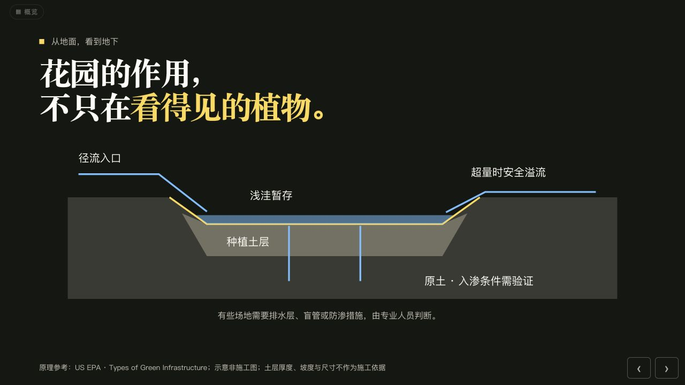
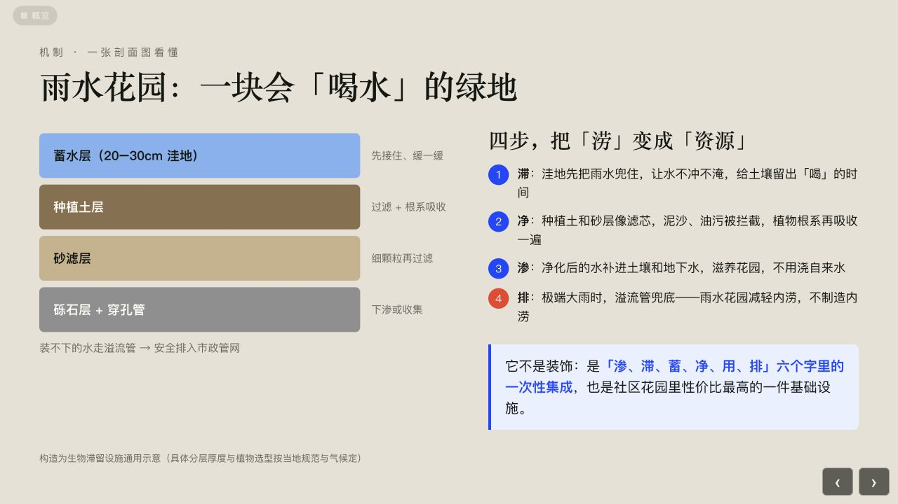
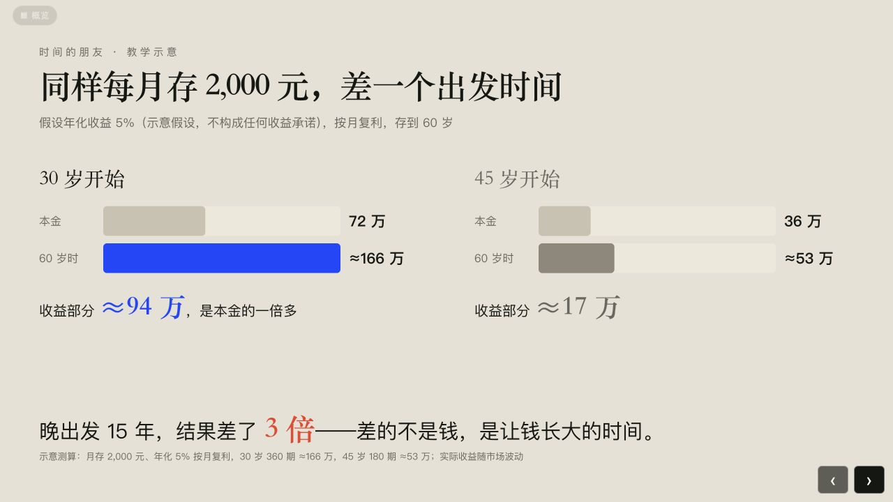

# 高质感 HTML 演示文稿设计技能

把提纲、逐字稿或资料，变成**好看，也好讲的网页演示**。不只是换模板，而是根据内容设计排版、配图与动效。

适用于 **Codex、豆包工作、Claude Code（CC）、WorkBuddy** 等能够读取技能文件、生成 HTML 的 AI 工作工具。

**[下载技能包 v2.2.1](https://github.com/deanyes/yangchao-presentation-design/raw/refs/heads/main/yangchao-presentation-design-v2.2.1.zip)** · **[查看使用说明](https://dedao.feishuapp.com/app/app_17dx4ayjc81/)**

## 先看实际效果

同一套技能，围绕两个 15 分钟分享主题制作。下面是 **Codex 与 WorkBuddy 的真实成品截图**，经过实际制作与迭代，不是“一次生成即可完全一致”的承诺。选取不同页面，展示各自的排版与表达方式。

### 社区花园雨水利用

| Codex 制作 · 开场与实景 | WorkBuddy 制作 · 结构与流程 |
| --- | --- |
|  |  |
| [播放完整演示](https://dedao.feishuapp.com/app/app_17dx4ayjc81/showcase/examples/rain-garden-15/index.html) | [播放完整演示](https://dedao.feishuapp.com/app/app_17dx4ayjc81/showcase/examples/workbuddy-rain-garden-15/index.html) |

### 养老规划

| Codex 制作 · 收支缺口 | WorkBuddy 制作 · 时间与积累 |
| --- | --- |
|  |  |
| [播放完整演示](https://dedao.feishuapp.com/app/app_17dx4ayjc81/showcase/examples/retirement-15/index.html) | [播放完整演示](https://dedao.feishuapp.com/app/app_17dx4ayjc81/showcase/examples/workbuddy-retirement-15/index.html) |

GitHub README 展示静态预览；翻页、概览和动效可在完整演示中体验。养老示例中的数字用于教学说明，不构成收益承诺或投资建议。

## 是什么风格？

**编辑式排版 × 空间证据**：纸白与墨黑打底，粗黑体与宋体搭配，大标题配留白。让图片、数据和关系成为主角，用动效帮助听众看懂变化。

- **不硬套页面**：根据观点、对比、流程、证据等内容选择呈现方式。
- **不乱加动效**：该自动播放的直接播放，需要配合讲述的分步展开。
- **不把逐字稿搬上屏**：区分听众要看的信息和讲者口述的内容。
- **交付前逐页检查**：检查遮挡、裁切、字号、图片比例和翻页交互。

## 一点制作经验：从 70 分的初稿开始

按我自己的制作感受，用过的一些类似技能，前几次生成往往只有 **50 分左右**。想把它做成真正能上台分享的作品，还需要持续告诉 AI：这页的重点是什么、内容该怎么呈现、排版哪里不顺、动效有没有帮助讲清楚。

这套技能把我反复修改时积累的经验，提前写成了制作标准，希望让你**第一次就能从 70 分左右的初稿开始**，少重复踩坑，把精力留给自己的内容。

**70 分是起点，不是终点。** 拿到初稿后，仍然要逐页看、持续反馈。比如：“这页我要强调的是前后变化，请用对比呈现”“图片才是证据，请放大，文字再少一点”。越具体的反馈，越能帮助 AI 把作品往前推进。

*50 分、70 分是作者基于个人制作经验的主观比喻，不是统一评测分数或效果保证；实际结果会受材料、模型和工具影响。*

## 怎么用？

### 1. 下载技能包

下载上面的 **`yangchao-presentation-design-v2.2.1.zip`**。不要把 GitHub 的「Code → Download ZIP」当成技能安装包。

### 2. 交给你使用的 AI 工具

- **WorkBuddy**：在「技能 → 添加技能 → 导入技能」中上传技能包。
- **Codex、豆包工作、Claude Code（CC）**：按工具支持的方式安装本地技能；也可以解压整个技能文件夹，放进当前项目，让 AI 读取其中的 `SKILL.md` 及其引用文件。不要只复制单独一份 `SKILL.md`。

不同工具的安装入口不相同。技能标识统一为 **`yangchao-presentation-design`**。

### 3. 发材料，说需求

上传你的提纲、逐字稿、图片或数据，再发这句话：

> 请使用 yangchao-presentation-design 技能，把这些材料做成一份适合 15 分钟分享的网页演示文稿。保持技能默认风格，根据内容设计排版、配图与动效，并逐页检查。

把时长改成自己的需要，也可以补一句“听众是谁”。**不需要你写代码或先填设计表**。生成的是用浏览器播放的 HTML 演示，不是 PowerPoint 文件。

本页展示的是 Codex 和 WorkBuddy 的实际效果；不同工具与模型的输出会有差异，仍需要结合内容迭代。

## 包里有什么？

完整技能源码随 ZIP 提供，包括 `SKILL.md`、设计与动效规范、空白演示底座、创建与检查脚本，以及按需参考的历史案例。它是一套制作标准，不是固定的成品页模板。

## 来源与致谢

由杨超结合实际分享制作中的多轮改稿经验整理。演示技术底座派生自 [花叔 Huashu Design](https://github.com/alchaincyf/huashu-design)，视觉思路参考 FIELD.IO。保留 [上游 MIT 许可全文](LICENSE-HUASHU.txt)，详见 [来源与致谢](CREDITS.md)。上游许可覆盖对应上游内容，不自动适用于本仓库全部新增内容。

Codex 雨水花园预览中的照片来自 Rogersoh 的 [Rain garden overview](https://commons.wikimedia.org/wiki/File:Rain_garden_overview.jpg)，采用 [CC BY-SA 3.0](https://creativecommons.org/licenses/by-sa/3.0/) 许可，演示中作了裁切。
